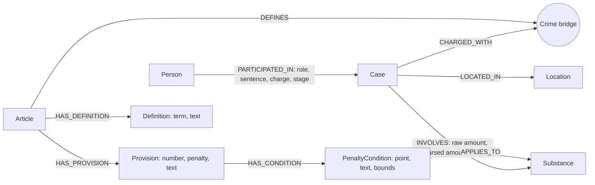

# Thiết kế Ontology — Day 19

**Họ tên:** Vũ Đức Minh  **MSSV:** 2A202602895<br>
**Lựa chọn:** Tự thiết kế ontology

## 1. Sơ đồ

`Crime` là node cầu nối giữa luật và tin tức. Các node luật giữ nguyên văn khoản, điểm và định nghĩa để dữ kiện truy xuất được đối chiếu với corpus.



## 2. Entity types (node labels)

| Label | Ý nghĩa | Khóa định danh (`MERGE` theo) | Properties | Lấy từ KB nào | Trích bằng |
| --- | --- | --- | --- | --- | --- |
| `Article` | Điều luật | `id` (số điều và tên luật) | `title`, `law`, `doc_id` | Luật | Metadata và Markdown |
| `Provision` | Khoản của một điều | `id` (Article + số khoản) | `number`, `penalty`, `text`, `doc_id` | Luật | Regex xác định khoản; giữ văn bản gốc |
| `PenaltyCondition` | Điểm hoặc điều kiện định lượng của khoản | `id` (Provision + điểm) | `point`, `text`, `min_amount`, `max_amount`, `unit`, `max_exclusive`, `doc_id` | Luật | Regex; chỉ điền ngưỡng khi nhận diện được số và đơn vị |
| `Definition` | Thuật ngữ được định nghĩa trong Luật PCMT | `id` (Article + thuật ngữ chuẩn hóa) | `term`, `text`, `doc_id` | Luật | Regex trên các khoản Điều 2 |
| `Crime` | Tội danh chuẩn dùng làm cầu nối | `name` | `doc_id` đầu tiên, `source_doc_ids` | Luật và tin | Tiêu đề luật; tội trong tin được liên kết qua `link_entity` |
| `Case` | Vụ việc được nêu trong một bài tin | `id` (`doc_id::case-N`) | `name`, `summary`, `date`, `stage`, `doc_id`, `source_title` | Tin | LLM trả JSON theo schema |
| `Person` | Người được nêu trong vụ | `id` (họ tên bỏ dấu và dấu câu) | `name`, `aliases`, `doc_id` đầu tiên, `source_doc_ids` | Tin | LLM; tên chuẩn hóa bằng mã |
| `Substance` | Chất ma túy chuẩn hóa | `name` | `aliases`, `doc_id` đầu tiên, `source_doc_ids` | Luật và tin | Regex và danh sách bí danh corpus-backed; tên tin được chuẩn hóa bằng mã |
| `Location` | Địa điểm báo chí nêu | `id` (tên bỏ dấu và dấu câu) | `name`, `doc_id` đầu tiên, `source_doc_ids` | Tin | LLM và chuẩn hóa mã |

`Article`, `Provision`, `PenaltyCondition`, `Definition` và `Case` là node theo tài liệu, có `doc_id` gốc. `Crime`, `Substance`, `Person` và `Location` được dùng chung; chúng giữ `doc_id` đầu tiên và tích lũy `source_doc_ids`.

## 3. Relationships

| Type | Từ → Đến | Properties trên cạnh | Ý nghĩa |
| --- | --- | --- | --- |
| `PARTICIPATED_IN` | `Person` → `Case` | `role`, `charge`, `sentence`, `stage`, `source_doc_id`, `source_doc_ids` | Gắn vai trò và tình trạng tố tụng vào đúng vụ, không gắn mức án trực tiếp vào node người dùng chung |
| `CHARGED_WITH` | `Case` → `Crime` | `source_doc_id` | Nối vụ tin tức với tội danh đã khớp danh mục luật |
| `DEFINES` | `Article` → `Crime` | `source_doc_id` | Nối tội danh luật với cầu `Crime` |
| `INVOLVES` | `Case` → `Substance` | `raw_amount`, `amount_value`, `unit`, `source_doc_id` | Lưu lượng chất nguyên văn và số đã quy đổi nếu parse được |
| `LOCATED_IN` | `Case` → `Location` | `source_doc_id` | Gắn địa điểm vào vụ cụ thể |
| `HAS_PROVISION` | `Article` → `Provision` | `source_doc_id` | Liệt kê khoản thuộc điều luật |
| `HAS_CONDITION` | `Provision` → `PenaltyCondition` | `source_doc_id` | Lưu điểm và điều kiện áp dụng trong khoản |
| `APPLIES_TO` | `PenaltyCondition` → `Substance` | `source_doc_id` | Chỉ ra chất mà điều kiện định lượng áp dụng |
| `HAS_DEFINITION` | `Article` → `Definition` | `source_doc_id` | Cho phép truy vấn trực tiếp định nghĩa thuật ngữ |

## 4. Node cầu nối giữa 2 KB

- **Node:** `Crime`, khóa chuẩn hóa theo tên tội.
- **Lý do:** các điều BLHS có tiêu đề tội danh; các bài báo nêu cáo buộc hoặc hành vi. Node này hỗ trợ đường đi `Case → Crime ← Article` mà không phụ thuộc vào tên vụ do LLM sinh.
- **Đảm bảo khớp:** prompt đưa danh sách tội danh lấy từ luật; sau trích xuất, mã gọi `link_entity` để khớp chính xác sau chuẩn hóa hoặc một fuzzy match có ngưỡng `0.8`. Kết quả phải là một tội danh đã biết.
- **Khi cầu có thể gãy:** bài không nêu tội danh, hoặc cách gọi không đủ gần để qua ngưỡng. Khi đó charge không được gắn và không tạo node `Crime` từ chuỗi lạ; giữ các dữ kiện vụ việc khác nhưng không suy diễn căn cứ luật.

## 5. Competency questions

| Câu | Đường đi (Cypher pattern) | Trả lời được? |
| --- | --- | --- |
| Q1 | `(Article)-[:HAS_DEFINITION]->(Definition)`; khớp `term` “tiền chất” và trả `text` | Có, lấy văn bản định nghĩa ở Điều 2 Luật PCMT |
| Q2 | `(Person)-[PARTICIPATED_IN {sentence}]->(Case)`; tìm câu có mức án tử hình và trả tên người cùng `sentence` | Có nếu LLM trích xuất được tên, vai trò và mức án từ bài |
| Q3 | `(Person)-[:PARTICIPATED_IN]->(Case)-[:CHARGED_WITH]->(Crime)<-[:DEFINES]-(Article)-[:HAS_PROVISION]->(Provision)`; chọn khoản 1; mức án 36 tháng lấy từ cạnh người-vụ | Có, dữ kiện án của tin và khung cơ bản của Điều 251 ở hai nguồn riêng |
| Q4 | `(Person)-[:PARTICIPATED_IN]->(Case)-[:CHARGED_WITH]->(Crime)<-[:DEFINES]-(Article)-[:HAS_PROVISION]->(Provision)`; chọn khoản có số lớn nhất trong điều khớp | Có nếu bài nêu cáo buộc/người và luật được liên kết; giữ giai đoạn “bị bắt” để không diễn đạt thành kết tội |
| Q5 | `(Person)-[:PARTICIPATED_IN]->(Case)-[INVOLVES]->(Substance)<-[:APPLIES_TO]-(PenaltyCondition)<-[:HAS_CONDITION]-(Provision)<-[:HAS_PROVISION]-(Article)-[:DEFINES]->(Crime)<-[:CHARGED_WITH]-(Case)`; so `amount_value`, `unit` với cận điều kiện | Có khi tin có khối lượng parse được và điều kiện luật có cùng chất/đơn vị; trả nguyên văn điểm và khoản khớp |
| Q6 | `(Substance)<-[:INVOLVES]-(Case)` rồi lần ngược `(Person)-[:PARTICIPATED_IN]->(Case)` | Có, gom các vụ có node `Substance` MDMA chung |

## 6. Quyết định thiết kế và đánh đổi

1. **Tách `Provision` và `PenaltyCondition`:** phương án gọn hơn là lưu mỗi khoản luật thành một node với danh sách tên chất. Cấu trúc tách riêng giữ được điểm và cận khối lượng để trả câu hỏi Q5; đổi lại có thêm node và cạnh.
2. **Khóa `Case` theo tài liệu và thứ tự trích xuất:** phương án dùng tên vụ do LLM đặt có thể gộp hai tin cùng mô tả. Khóa `doc_id::case-N` giữ các lần đưa tin thành hai vụ bản ghi riêng; đổi lại hai bài cùng một vụ chưa được hợp nhất tự động.
3. **Lưu án và giai đoạn trên cạnh người-vụ:** phương án đặt `sentence` trên `Person` làm mất tính đúng đắn khi một người xuất hiện trong nhiều vụ hoặc ở các giai đoạn khác nhau. Cạnh `PARTICIPATED_IN` giữ thông tin theo nguồn/vụ; đổi lại truy vấn người cần đi qua cạnh.
4. **Tách chuẩn hóa tội danh khỏi trích xuất LLM:** phương án tin nguyên văn chuỗi LLM có thể tạo tội danh không có trong luật. Mã chỉ liên kết tên đã biết; đổi lại cách viết quá khác chuẩn sẽ không tạo cầu.

## 7. So với ontology gợi ý

| Điểm khác | Gợi ý làm gì | Thiết kế này làm gì | Vấn đề được xử lý | Bằng chứng |
| --- | --- | --- | --- | --- |
| Danh tính vụ | `Case` dùng tên do LLM sinh làm khóa | Dùng `doc_id::case-N`, giữ tên làm nội dung | Không gộp nhầm hai vụ chỉ vì tên do LLM đặt trùng hoặc thay đổi | Graph thật có 16 `Case`; Cypher mục 8 cho thấy khóa gắn nguồn. Hai đoạn tin cùng nhắc Huy còn thành hai ID khác nhau: đây là đánh đổi có chủ ý, đồng thời là lỗi E3 cần xử lý bằng entity resolution |
| Cấu trúc luật | `Clause` gom khoản và văn bản | Tách `Provision` khỏi từng `PenaltyCondition` theo điểm | So khối lượng với ngưỡng của đúng chất, lấy đúng điểm/khoản và mức phạt | Cypher mục 8 khớp `9.600 g MDMA` với ngưỡng `100 g`, trả khoản 4 điểm b Điều 250. Q5 custom nêu điểm b; bản hint chỉ nêu khoản 4 |
| Chất đồng nghĩa | Tạo chất từ chuỗi nhận diện | Chuẩn hóa alias sang một node `Substance` canonical và giữ alias | Tránh tách `thuốc lắc` khỏi MDMA | Graph thật trả một node `MDMA`, có alias `thuốc lắc`; `source_doc_ids` chứa cả tài liệu luật và tin |
| Định nghĩa luật | Không có label riêng cho thuật ngữ | Tạo `Definition` và nối trực tiếp với `Article` | Truy vấn Q1 lấy thẳng định nghĩa thay vì tìm trong văn bản khoản | Graph thật có 14 node `Definition`; truy vấn `toLower(d.term) = 'tiền chất'` trả đúng văn bản Điều 2 |
| Giai đoạn tố tụng | Giai đoạn có thể chỉ được viết trong câu mô tả hoặc lẫn với người/vụ | Lưu `stage` trên cạnh `PARTICIPATED_IN` và trên `Case` theo nguồn | Giữ trạng thái “bị bắt”, “bị truy tố”, “bị tuyên án” theo từng vụ, tránh gắn vĩnh viễn vào node người dùng chung | Q4 custom vẫn diễn đạt “bị bắt”; thuộc tính gắn với quan hệ người-vụ, không phải thuộc tính toàn cục của `Person` |

### Kết quả graph thực tế

Sau lần nạp benchmark đầy đủ, Neo4j có **477 node / 710 quan hệ**. Truy vấn `MATCH (n) UNWIND labels(n) AS label RETURN label, count(*) AS nodes ORDER BY label` trả đúng các label trong sơ đồ:

| Label | Số node |
| --- | ---: |
| `Article` | 18 |
| `Case` | 16 |
| `Crime` | 13 |
| `Definition` | 14 |
| `Location` | 9 |
| `PenaltyCondition` | 257 |
| `Person` | 37 |
| `Provision` | 99 |
| `Substance` | 14 |

Truy vấn `MATCH ()-[r]->() RETURN type(r), count(*) ORDER BY type(r)` xác nhận đủ 9 loại quan hệ đã mô tả: `APPLIES_TO` (222), `CHARGED_WITH` (19), `DEFINES` (13), `HAS_CONDITION` (257), `HAS_DEFINITION` (14), `HAS_PROVISION` (99), `INVOLVES` (25), `LOCATED_IN` (14), `PARTICIPATED_IN` (47). Tổng bằng 710.

GraphRAG custom đạt trung bình **recall 1.00 / judge 2.00** trên Q1–Q6; bản ontology hint đạt **0.94 / 1.83**. Khác biệt năng lực rõ nhất là Q6: custom **1.00 / 2**, hint **0.67 / 1**. Câu trả lời custom gọi được vụ tại Viện Pháp y tâm thần Trung ương mà câu trả lời hint bỏ sót. Q5 custom nêu thêm điểm b và điều kiện 100 gam trở lên; hint chỉ nêu khoản 4. Các kết quả đầy đủ nằm trong `ket_qua_benchmark_kg.txt` và `ket_qua_benchmark_kg.hint.txt`.

## 8. Hạn chế còn lại

- Trích xuất tin cậy vào nội dung JSON của LLM. Tin không nêu tên chất, người hoặc cáo buộc rõ ràng có thể tạo node thiếu thông tin.
- Chuẩn hóa người bỏ dấu giúp nối các biến thể “Nguyễn”/“Nguyen”, nhưng có thể gộp hai người trùng họ tên; chưa dùng ngày sinh hay định danh pháp lý để tách đồng danh.
- Khóa vụ theo tài liệu tránh gộp nhầm, nhưng chưa phát hiện hai bài nói về cùng một vụ.
- Parser chỉ chuyển đổi số lượng có mẫu và đơn vị nhận diện rõ. Với điều kiện không parse được, text vẫn được giữ nguyên và cận số để trống; truy vấn không được xem đó là một match định lượng.
- Fuzzy matching có thể không khớp cách gọi quá khác luật. Ngưỡng thấp hơn có thể tăng nối nhầm; cần đánh giá trên corpus trước khi đổi.

## 9. Cypher kiểm chứng trên graph

### Đường cầu từ tin sang luật

```cypher
MATCH path=(:Person)-[:PARTICIPATED_IN]->(:Case)-[:CHARGED_WITH]->(:Crime)<-[:DEFINES]-(:Article)
RETURN path LIMIT 3;
```

Neo4j Browser trả 3 đường; Results overview có `Person (3)`, `Case (2)`, `Crime (1)`, `Article (1)` cùng ba loại cạnh `PARTICIPATED_IN`, `CHARGED_WITH`, `DEFINES`. Ảnh: `report/img/kg_cross_kb.png`.

### Điều kiện khối lượng Q5

```cypher
MATCH (k:Case {id:'news-100260917203001265::case-1'})-[i:INVOLVES]->(s:Substance {name:'MDMA'}),
      (p:Person)-[:PARTICIPATED_IN]->(k),
      (k)-[:CHARGED_WITH]->(c:Crime)<-[:DEFINES]-(a:Article)-[:HAS_PROVISION]->(v:Provision)
      -[:HAS_CONDITION]->(t:PenaltyCondition)-[:APPLIES_TO]->(s)
WHERE p.id='cai quang huy'
  AND i.amount_value >= t.min_amount
  AND (t.max_amount IS NULL OR i.amount_value < t.max_amount
       OR (i.amount_value=t.max_amount AND NOT coalesce(t.max_exclusive,false)))
WITH k, i, s, p, a, c, v, t ORDER BY t.min_amount DESC
RETURN p.name, i.raw_amount, i.amount_value AS grams, s.name, a.id, v.number,
       t.point, t.min_amount AS threshold_g, t.text, v.penalty LIMIT 1;
```

Kết quả: `Cái Quang Huy`; `hơn 9,6kg`; `9600.0 g`; `MDMA`; `Điều 250 BLHS`; khoản `4`, điểm `b`; ngưỡng `100.0 g`; mức phạt `20 năm, tù chung thân hoặc tử hình`.

### Trùng vụ do khóa theo tài liệu (E3)

```cypher
MATCH (k:Case)-[i:INVOLVES]->(s:Substance {name:'MDMA'}),
      (p:Person {id:'cai quang huy'})-[:PARTICIPATED_IN]->(k)
WHERE i.raw_amount CONTAINS '9,6'
RETURN k.id, k.name, k.doc_id, k.source_title, p.name, s.name, i.raw_amount
ORDER BY k.doc_id;
```

Kết quả có hai `Case`:

| `Case.id` | `doc_id` | Tên vụ | Khối lượng |
| --- | --- | --- | --- |
| `news-100260917203001265::case-1` | `news-100260917203001265` | Cái Quang Huy và Nguyễn Tiến Đạt vận chuyển trái phép chất ma túy | hơn 9,6kg |
| `news-100260918080821054::case-2` | `news-100260918080821054` | Vụ án vận chuyển ma túy của Cái Quang Huy | 9,6kg |

Hai đoạn nguồn cùng nhắc người `Cái Quang Huy`, chất MDMA và sự kiện vận chuyển từ Đức; đoạn thứ hai xuất hiện ở phần cuối bài về kháng cáo của nhóm Lê Minh Thành. Khóa theo tài liệu bảo toàn nguồn và tránh gộp nhầm; nó cũng khiến một sự kiện được nhắc ở nhiều tài liệu chưa hợp nhất. Có thể thêm node `Event` canonical và cạnh `REPORTS`, sau đó chỉ hợp nhất khi tên người, chất, lượng và mốc/sự kiện cùng khớp; đổi lại cần entity resolution có ngưỡng và kiểm soát gộp nhầm.

## 10. Ảnh Neo4j Browser

- `report/img/kg_count.png`: Q-A, đủ 9 label cùng số node.
- `report/img/kg_cross_kb.png`: Q-B, tab Graph và Results overview thể hiện đường cầu hai KB.
- `report/img/kg_my_case.png`: Q-D, người tự chọn **Cái Quang Huy**, đi tới Điều 250 và các node MDMA, Ketamine, Hà Nội.
